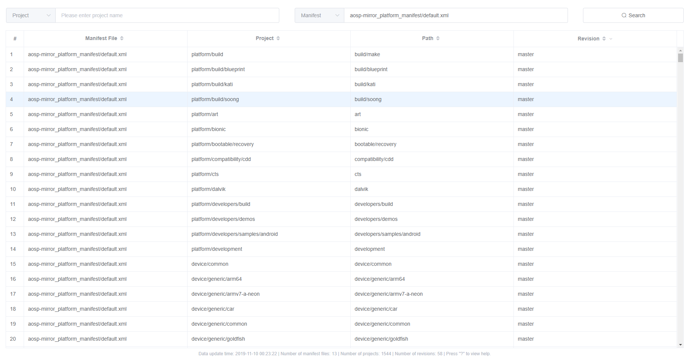
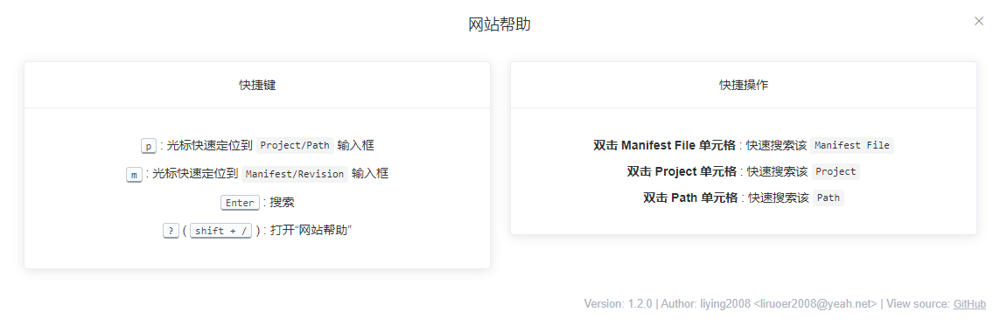

# Manifest Revision Query

[](https://github.com/liying2008/manifest_revision_query/releases)


该仓库包含 **manifest 文件解析脚本**和**前端查询页面**。

## 1. 前端网站搭建

- **方法1**

直接从 [release](https://github.com/liying2008/manifest_revision_query/releases) 页面下载已打包好的 `dist.zip` ，解压到 web 容器（如 Apache）中即可。

- **方法2**

进入 `frontend` 目录自行编译打包。

```shell
npm i
npm run build
```

生成物会放在 `frontend/dist` 目录中，将此目录中的文件拷贝到 web 容器（如 Apache）中即可。


## 2. 配置文件说明：

```json
{
  "manifest_root_dir": "manifests",
  "manifest_dirs_for_query": [],
  "manifest_file_list": "manifest_files.txt",
  "excluded_files": [],
  "ignore_parse_error": false,
  "analysis_upstream_first": true,
  "frontend_static_dir": "D:/phpStudy/WWW/manifest/static"
}
```

1. `manifest_root_dir` : manifest 根目录

2. `manifest_dirs_for_query` : 待查询的目录

    > 该目录下所有 manifest 文件都会被解析。此项设置建议留空，最好将待查询的文件列表导出到一个文件中，配置给 `manifest_file_list` 属性

3. `manifest_file_list` : 待查询的文件列表

    > 格式为：一行一个文件（包含路径，路径相对于 manifest 根目录，不包含 manifest 根目录，如 `AAA/BBB/C.xml`）

4. `excluded_files` : 需要被排除的 manifest 文件列表

    > 格式为：一行一个文件（包含路径，路径相对于 manifest 根目录，不包含 manifest 根目录，如 `AAA/BBB/C.xml`）

5. `ignore_parse_error` : 解析 manifest 文件时遇到错误时是否忽略并跳过

6. `analysis_upstream_first` : 是否优先解析 upstream 属性 
 
    > true: 先解析 upstream, 无值，再解析 revision  
    > false: 只解析 revision

7. `frontend_static_dir` : 网站 static 目录，解析结果会放到 static 目录中

## 3. 执行解析脚本

**脚本运行环境：**

- Python 3

**命令：**

```shell
python parser.py
```

## 4. 网站截图

- **前端查询界面**



- **网站帮助**



## LICENSE

[MIT](LICENSE)
